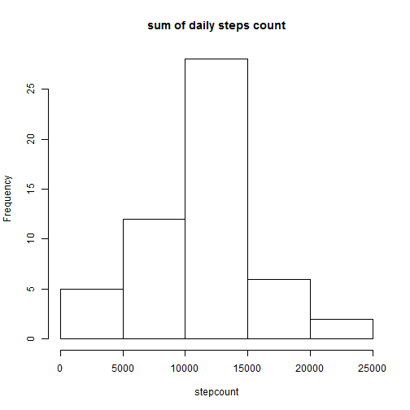
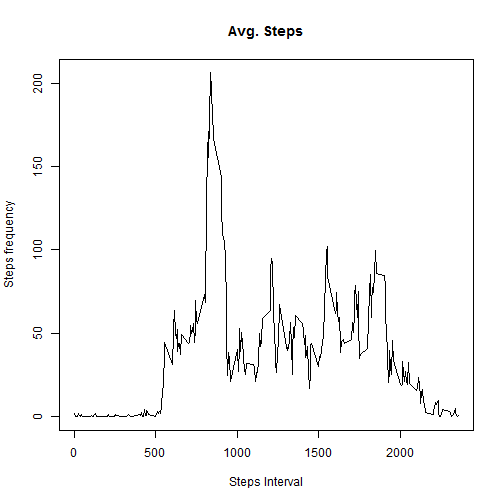
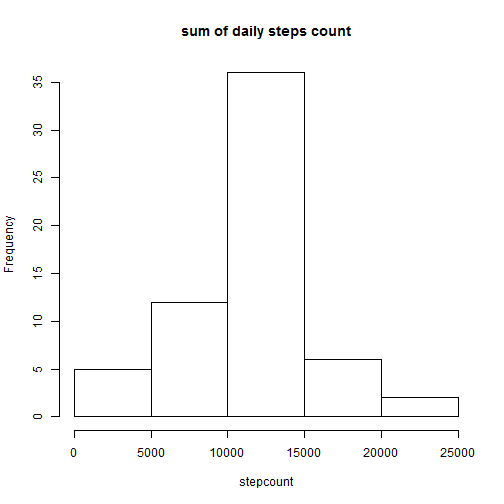
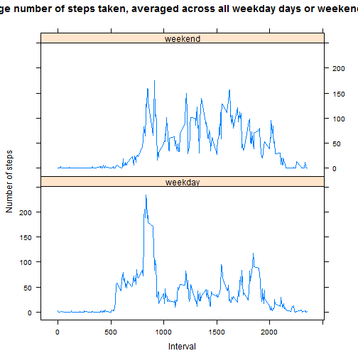

##Loading and preprocessing the data


```r
opts_chunk$set(echo = TRUE, results = "asis")
```


```r
data <- read.csv("activity.csv",header=TRUE, sep = ",",stringsAsFactors = FALSE)
#take complete cases for further processing
data_comp <- data[complete.cases(data), ]
attach(data_comp)
```

##What is the mean total number of steps taken per day?


```r
library(dplyr)
#avgSteps = mean(steps, na.rm=TRUE)
daySteps = aggregate(steps,by=list(date),FUN=sum,simplify = TRUE)[2]
hist(daySteps$x,main = "sum of daily steps count",xlab="stepcount")
```

 

```r
medSteps = median(daySteps$x,na.rm=TRUE)
meanSteps = round(mean(daySteps$x,na.rm=TRUE))
```

Thus mean and median of total steps taken per day are 1.0766 &times; 10<sup>4</sup> and 10765 respectively

##What is the average daily datos pattern?


```r
stepInterval <- aggregate(steps,by=list(interval),FUN=mean,simplify = TRUE)[2]
plot(unique(interval),stepInterval$x,type="l",main ="Avg. Steps", ylab="Steps frequency", xlab="Steps Interval")
```

 

```r
maxInterval <- stepInterval[which.max(stepInterval$x),]
```
The highest steps in any interval is 206.1698113

## Imputing missing values

```r
missingValues <- sum(!complete.cases(data))
for (i in 1:nrow(data)) {
  if(is.na(data$steps[i])){
      data$steps[i] <- stepInterval[i%%288+1,1]
  }
}
daySteps2 = aggregate(data$steps,by=list(data$date),FUN=sum)[2]
hist(daySteps2$x,main = "sum of daily steps count",xlab="stepcount")
```

 

```r
medSteps2 = median(daySteps2$x,na.rm=TRUE)
meanSteps2 = mean(daySteps2$x,na.rm=TRUE)
```
Total rows with missing values are 2304
Thus mean and median of total steps taken per day are 1.0766189 &times; 10<sup>4</sup> and 1.0766189 &times; 10<sup>4</sup> respectively.
We observe that mean and median does change.
Mean, median for the day might not be ideal to replace for missing values, as person might
be doing some physical exercise in morning where number os steps would be large. Hence we should
fill the missing value by taking mean for the interval.

##Are there differences in activity patterns between weekdays and weekends?

```r
data_comp['day'] <- weekdays(as.Date(date))
data_comp$day[data_comp$day  %in% c('Saturday','Sunday') ] <- "weekend"
data_comp$day[data_comp$day != "weekend"] <- "weekday"
stepInterval2 <- aggregate(steps,by=list(interval,data_comp$day),FUN=mean)
library(lattice)
xyplot(stepInterval2$x ~ stepInterval2$Group.1 |stepInterval2$Group.2
     , type = "l"
     , xlab = "Interval"
     , ylab = "Number of steps"
     , main = "Average number of steps taken, averaged across all weekday days or weekend days"
     , layout = c(1, 2))
```

 

```r
detach(data_comp)
```

Note that the `echo = FALSE` parameter was added to the code chunk to prevent printing of the R code that generated the plot.
